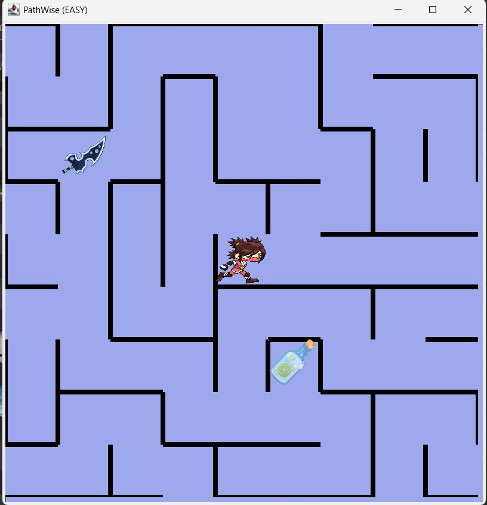
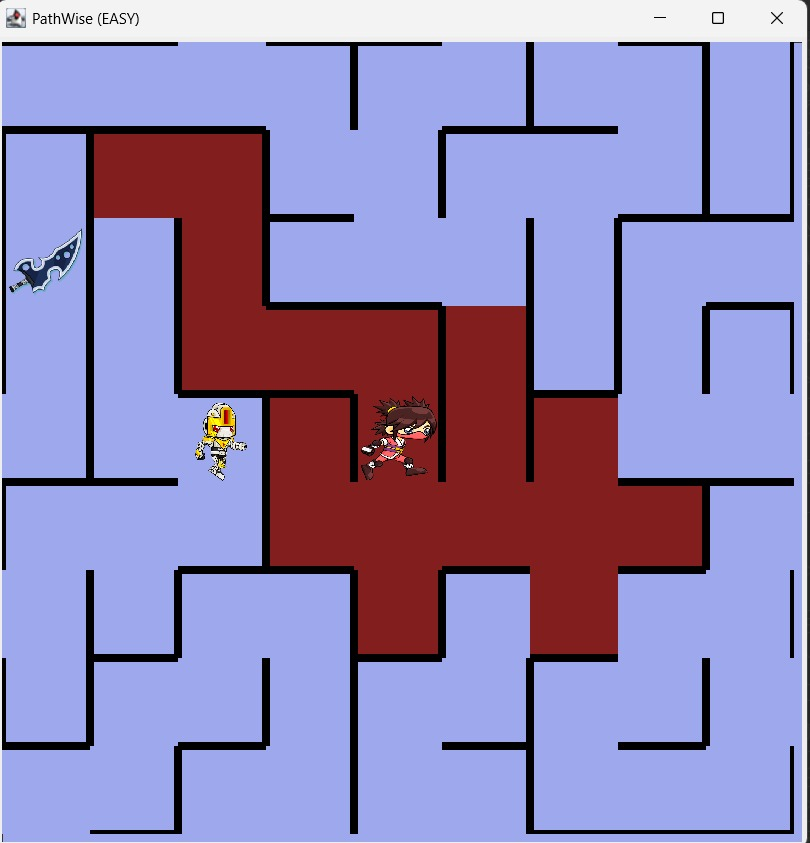
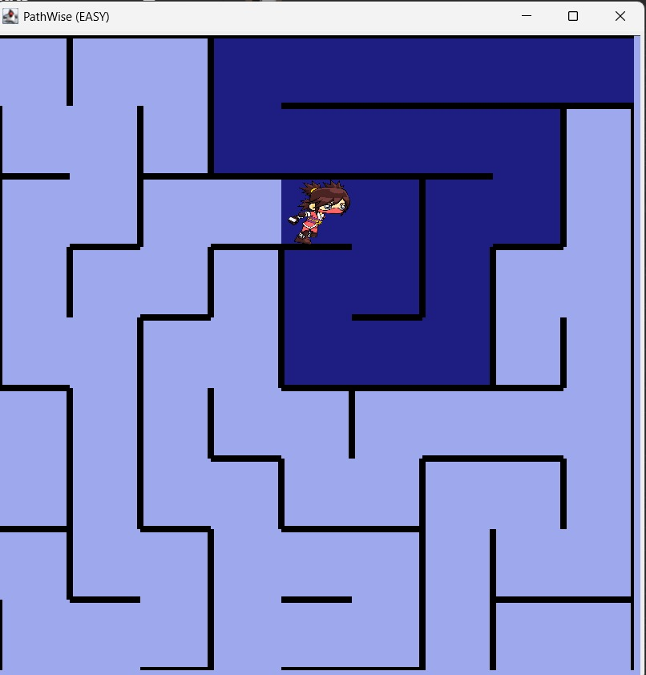
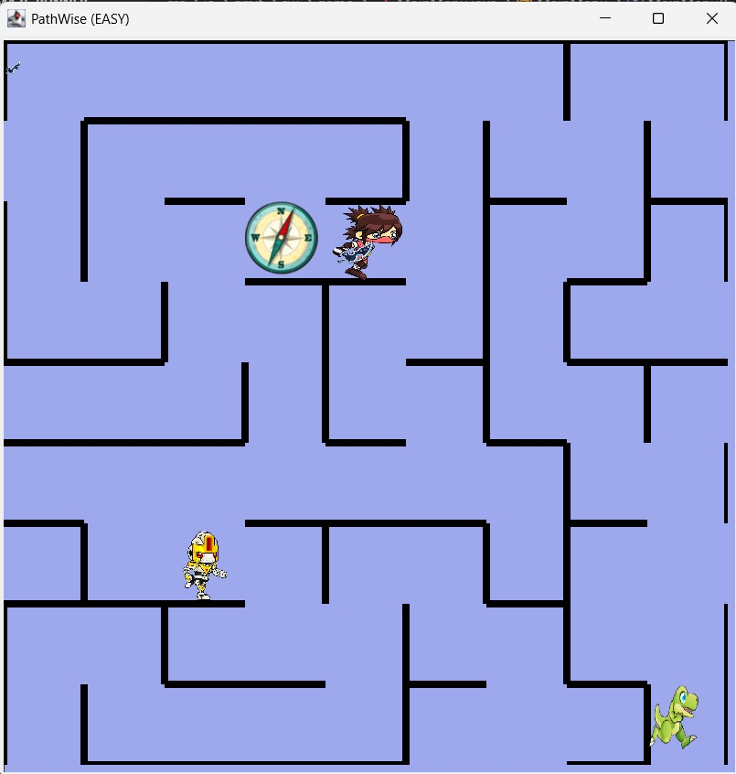
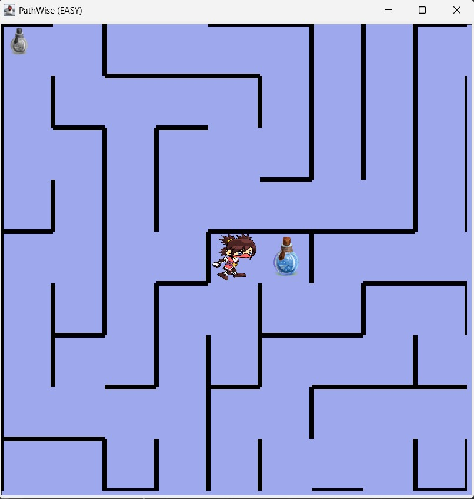
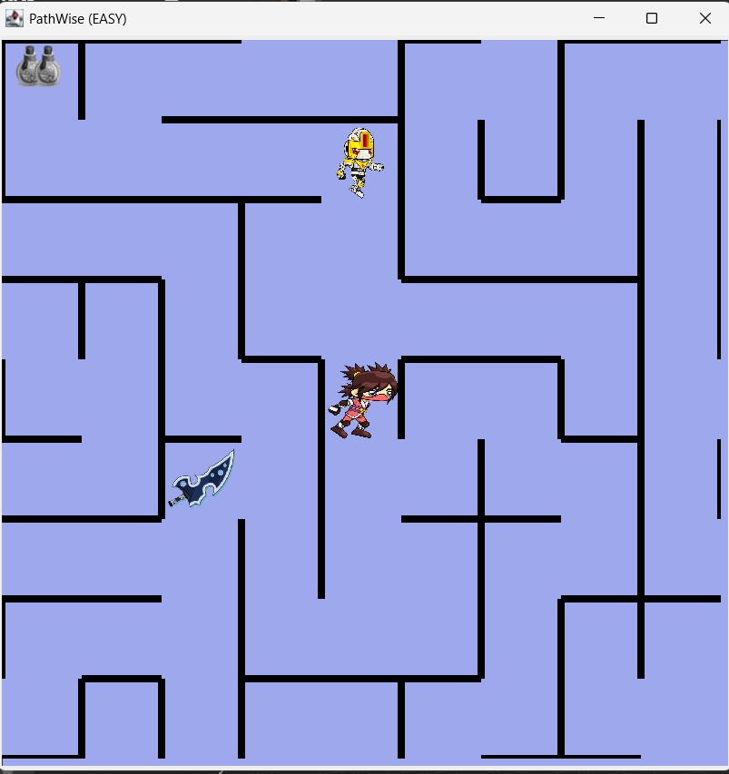
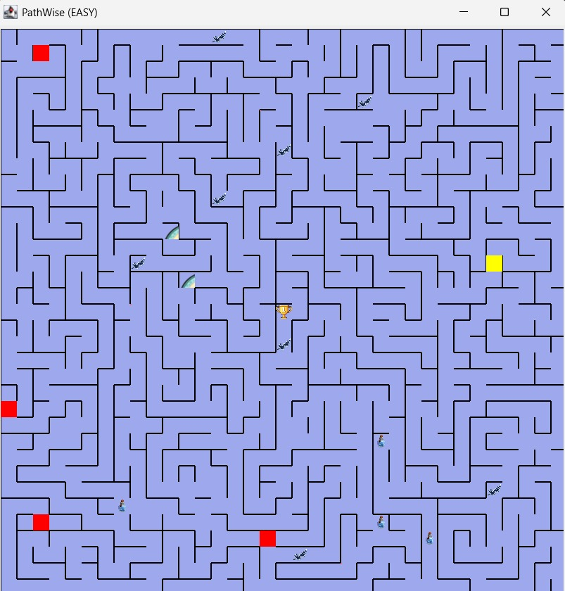
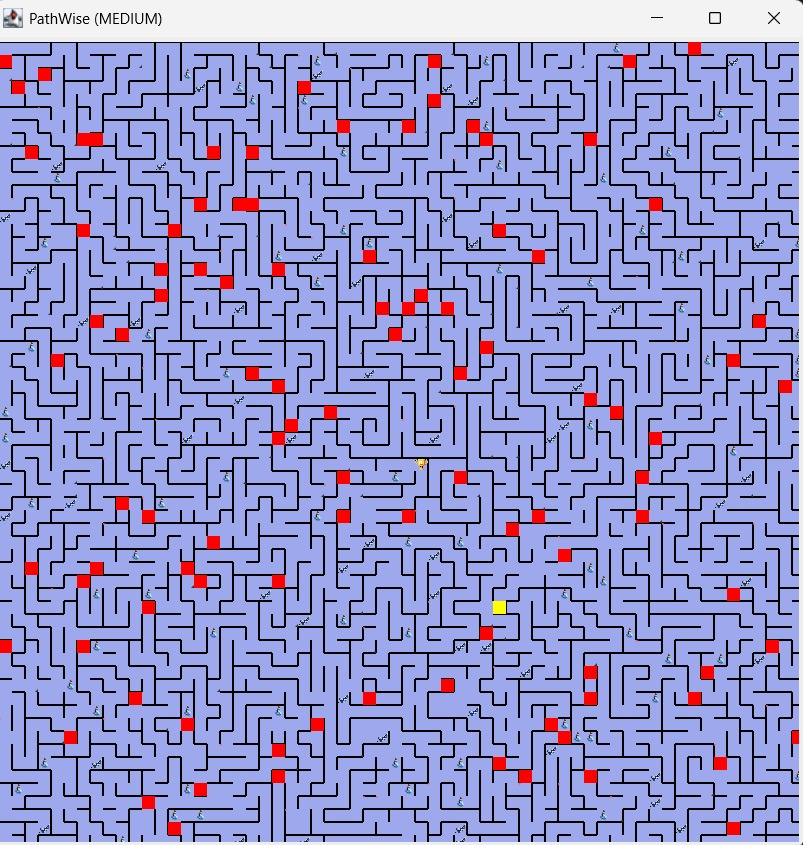
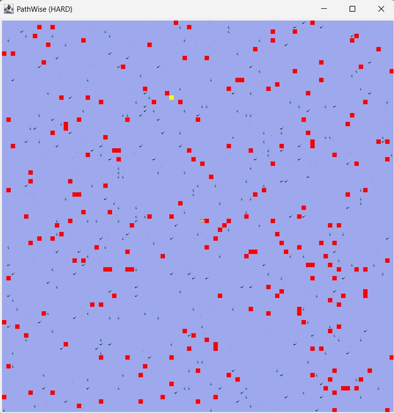

# PathWise: Exploring AI Reasoning through Evolving Maze Challenges

A dynamic maze game demonstrating AI search algorithms and fuzzy logic.

## Overview

PathWise is a Java-based AI demonstration game set inside a constantly changing maze.
The maze evolves every few seconds, enemies navigate using different search algorithms, and combat outcomes depend on fuzzy logic instead of fixed win/lose rules.

The goal is simple:

➡ Reach the center of the maze while avoiding enemies, collecting items, and making strategic decisions.

This project was created to visualize how various AI techniques behave in dynamic, unpredictable environments.

## Gameplay Summary

- You play as the main character navigating through a maze.
- The maze updates every 20 seconds, changing paths and blocking/creating routes.
- Enemies use different AI algorithms to move.
- Items like the sword, mana bottle, and compass assist you.
- Combat is handled using fuzzy logic instead of fixed rules.

## AI Techniques Used

### 1. Search Algorithms

| Entity / Feature | Algorithm Used       | Purpose                          |
|------------------|----------------------|----------------------------------|
| Robot            | DFS                  | Patrol-like deep movement        |
| Dino             | Best-First Search    | Fast chasing using heuristic     |
| Zombie           | Random Movement      | Simple unpredictable behavior    |
| Compass          | A* Search            | Shows the shortest path to the goal |
| Spell            | Depth-Limited DFS    | Clears enemies within limited range |

#### Entity Images

| Robot | Dino | Zombie | Main Character |
|---|---|---|---|
|  |  |  |  |

#### Item Icons

| Sword | Compass | Spell |
|---|---|---|
|  |  |  |


### 2. Fuzzy Logic (Combat System)

Used to compute win probability based on:

- Mana level → fuzzy sets: Low / Medium / High
- Sword possession → crisp binary input (0 or 1)

This produces realistic, uncertain combat outcomes.

### 3. Dynamic Environment

- Maze generated using DFS-based algorithm
- Maze mutates periodically
- All agents must update decisions as the environment shifts

## Project Features

-  Dynamic maze that updates every 20 seconds
-  Multiple enemy types with different search behaviors
-  Fuzzy-logic-based combat system
-  A* compass for real-time guidance
-  Threaded enemy movement for smooth gameplay
-  Supports multiple maze sizes (35×35, 65×65, 90×90)

## System Architecture

- Maze Generator – Creates and updates maze using DFS
- Player Module – Movement, item collection, combat
- Enemy AI – Robot, Dino, Zombie, Spell behavior
- AI Logic Engine – Search algorithms + fuzzy decision system
- Thread Manager – Handles parallel enemy movement
- Renderer – Displays the maze and game state

## Tech Stack

- Java 8+
- JFuzzyLogic (for fuzzy inference)
- Swing / AWT (UI)
- Multi-threading (for enemy AI)

## How to Run

1. Install Java 8 or above
2. Clone the repository:

```sh
git clone https://github.com/your-username/pathwise.git
```

3. Add `jFuzzyLogic.jar` to your project’s classpath
4. Run the main file:

```sh
java -cp Maze.jar:libs/jFuzzyLogic.jar ie.gmit.sw.game.GameRunner
```

Update paths based on your directory structure.

## Project Structure

```
/src
  ├── ie.gmit.sw.ai               → Enemy AI strategies
  ├── ie.gmit.sw.game             → Game runner + view
  ├── ie.gmit.sw.gameassets       → Player, enemies, items
  ├── ie.gmit.sw.maze             → Maze generator + cell classes
  └── ie.gmit.sw.threads          → Threads for enemy movement, effects
/resources
/libs
```

## Controls

| Key          | Action                         |
|--------------|--------------------------------|
| Arrow Keys   | Movement                       |
| Z            | Zoom in/out                    |
| A            | Activate special spell         |
| Collect Sword| Increased combat chance        |
| Collect Mana | Boosts fuzzy-logic win probability |
| Compass      | Shows A* path temporarily      |

## Maze Levels

- Easy: 35 × 35
- Medium: 65 × 65
- Hard: 90 × 90

## Testing & Results

- DFS patrol works well in static paths but gets confused when maze updates.
- Best-First Search chases efficiently even after maze changes.
- A* consistently finds shortest path.
- Fuzzy logic provides variable combat results based on mana and sword.
- Game runs smoothly for all maze sizes.

## Future Enhancements

- Reinforcement learning enemies
- Smarter adaptive difficulty
- Visual heatmaps for search visualization
- Multi-player mode
- Additional fuzzy parameters (health, distance, weapon strength)

## Screenshots


| Game Intro | Gameplay |
|---|---|
|  |  |

| Spell Used | Compass Used | Sword Equipped |
|---|---|---|
|  |  |  |


- `mana.jpeg` – Mana pickup/indicator
- `robot.jpeg` – Robot enemy in maze
- `level-easy.jpeg` – Easy maze overview
- `level-medium.jpeg` – Medium maze overview
- `level-hard.jpeg` – Hard maze overview

| Mana | Robot |
|---|---|
|  |  |

### Levels Of Difficulty

| Easy | Medium | Hard |
|---|---|---|
|  |  |  |

## Contributors

- Palak Bhatt
- Shivin Khandelwal
- Anish Choudhary
- Mohammad Hafiz Shah


## License

This project is for educational and academic purposes only.

